# AI Showcase — SEO Content Pipeline

Ghi lại các khoảnh khắc quan trọng trong 3 ngày build skill. Mỗi screenshot ghi lại một human insight của Vee hoặc một AI problem-solving moment.

---

## Screenshot 1 — Brainstorm ý tưởng ban đầu

**File:** `01-initial-brainstorm.png`

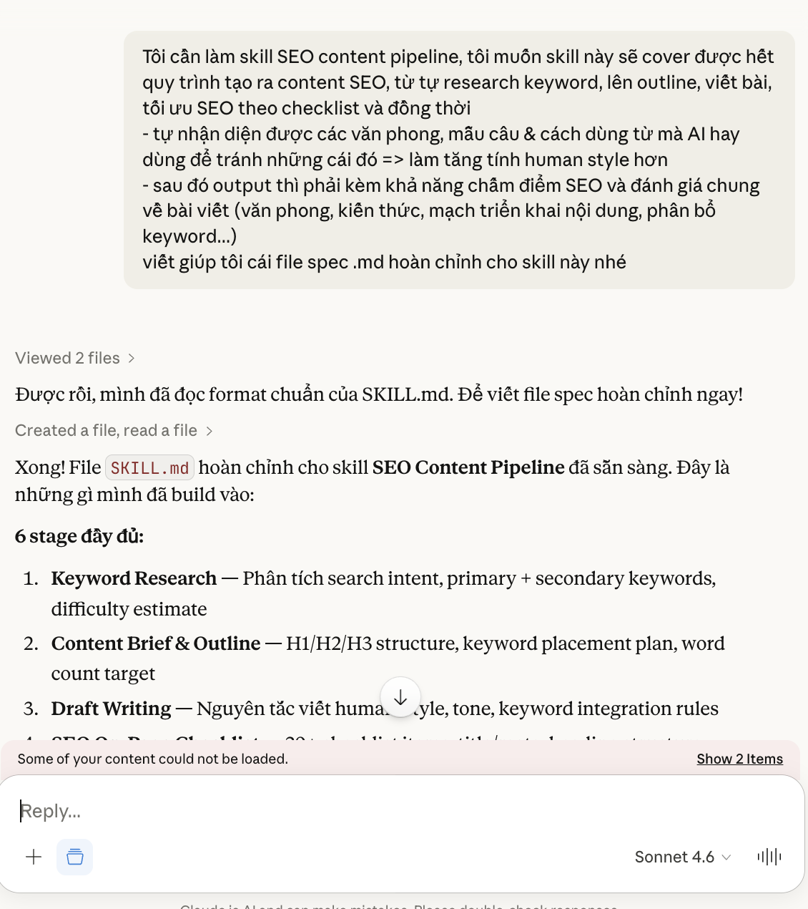

**Human insight:** Vee define đủ 4 thành phần core của skill chỉ trong một prompt đầu tiên — keyword research, outline, AI-pattern detection, và scoring report.

---

## Screenshot 2 — Brainstorm: ý tưởng kết hợp 3 nguồn data cho keyword

**File:** `02-brainstorm-3-sources.png`

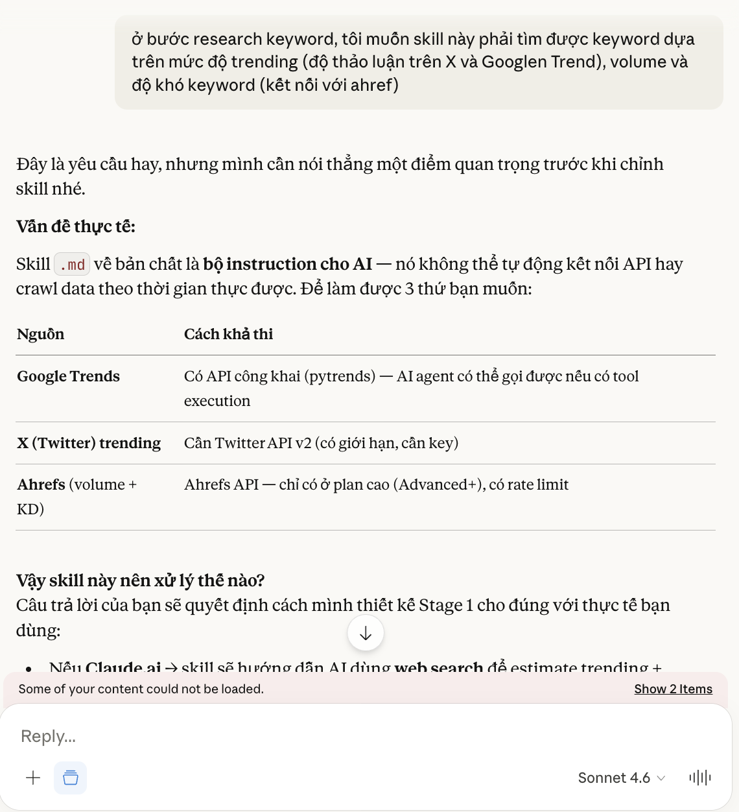

**Human insight:** Vee đề xuất kết hợp Google Trends + X/Twitter buzz + Ahrefs — insight gốc tạo ra sự khác biệt của skill so với SEO prompt thông thường.

---

## Screenshot 3 — Brainstorm: mở rộng AI-pattern library và yêu cầu data thực

**File:** `03-ai-pattern-brainstorm.png`

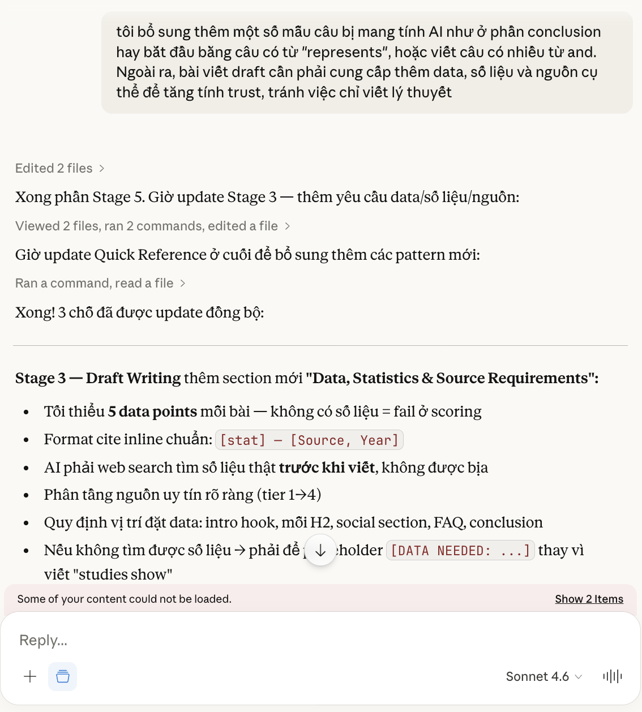

**Human insight:** Vee identify các AI pattern mới từ việc review output thực tế (represents, and-chain, conclusion patterns) và đặt ra yêu cầu data/nguồn cụ thể để tăng trust.

---

## Screenshot 4 — AI thiết kế keyword scoring formula

**File:** `04-keyword-scoring-formula.png`

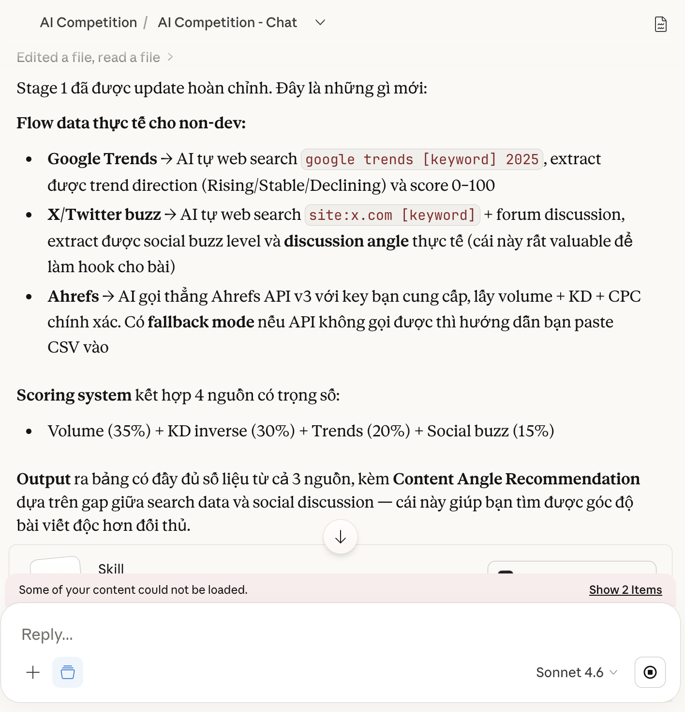

**AI problem-solving:** AI dịch ý tưởng 3 nguồn của Vee thành công thức có trọng số cụ thể (Volume 35% / KD 30% / Trends 20% / Buzz 15%) với log scale để tránh volume dominate.

---

## Screenshot 5 — Vee phát hiện vấn đề, AI đề xuất HARD RULES block

**File:** `05-hard-rules-proposal.png`

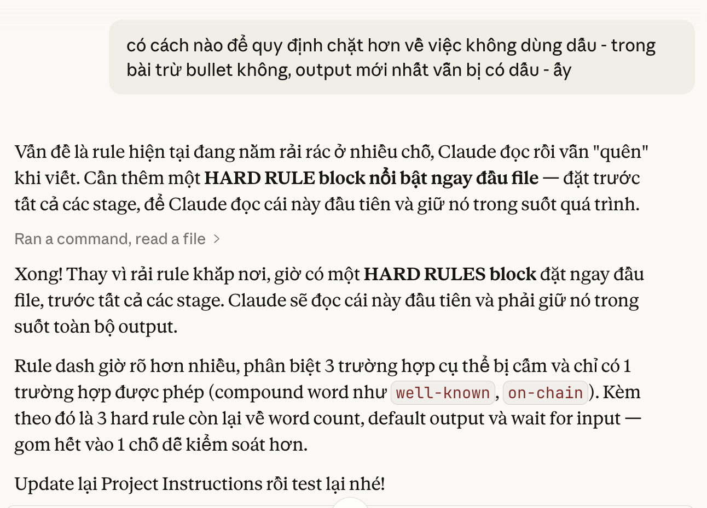

**Collaboration:** Vee phát hiện dash rule vẫn bị vi phạm dù đã viết nhiều lần — AI chẩn đoán nguyên nhân (rule rải rác = Claude quên) và đề xuất gom vào 1 HARD RULES block đặt đầu file.

---

## Screenshot 6a + 6b — Phát hiện bug volume hallucination

**Files:** `06a-volume-hallucination-discovery.png` · `06b-volume-hallucination-confirm.png`

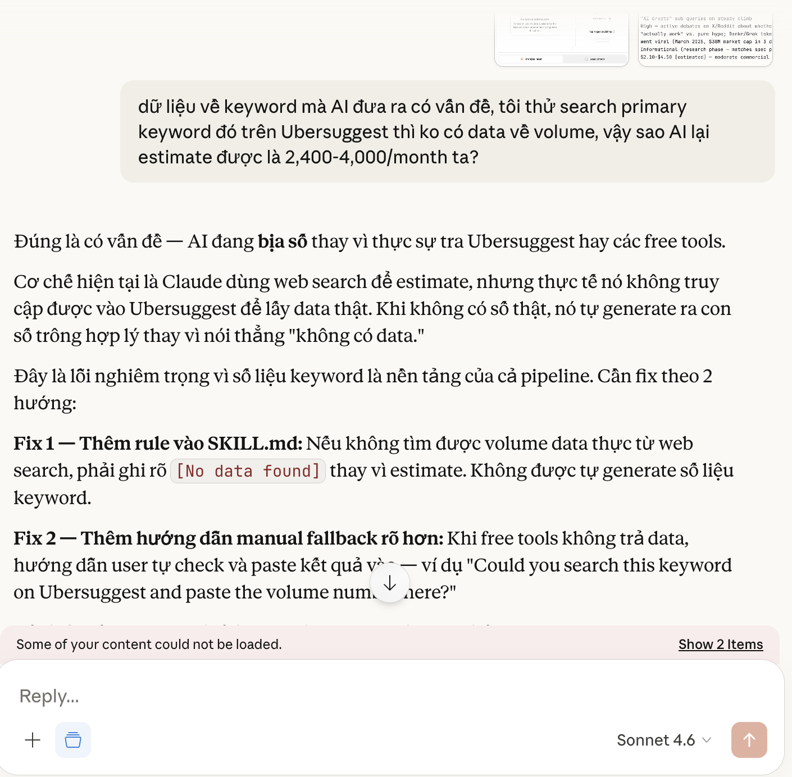

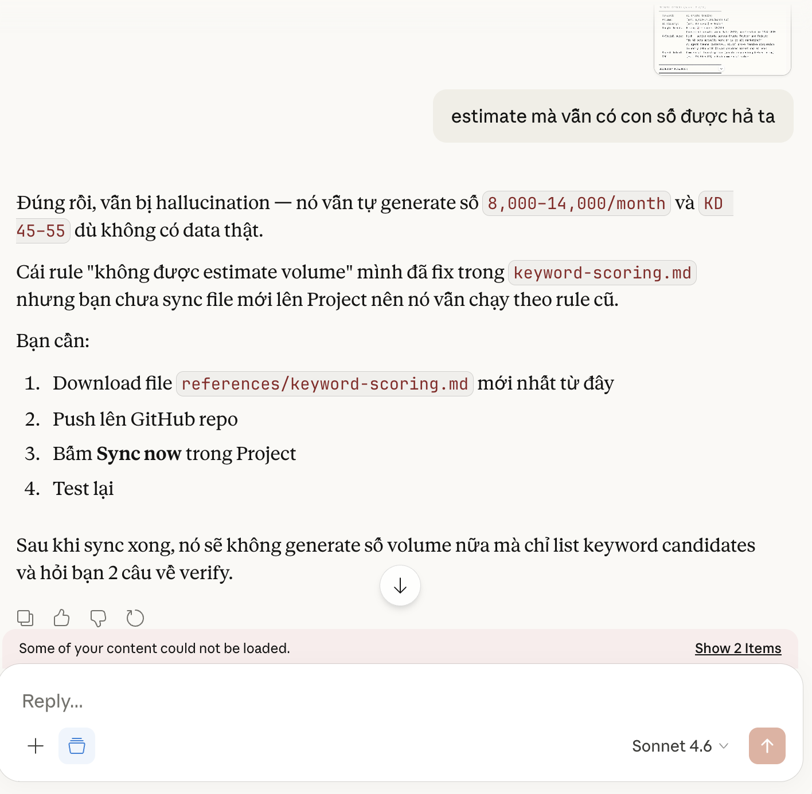

**Human insight:** Vee test thực tế và phát hiện AI tự bịa số volume dù không có data thật (6a) — sau khi fix vẫn còn bug vì file chưa được sync lên Project (6b).

---

## Screenshot 7 — AI restructure Stage 1 thành Turn 1 / Turn 2

**File:** `07-turn1-turn2-restructure.png`

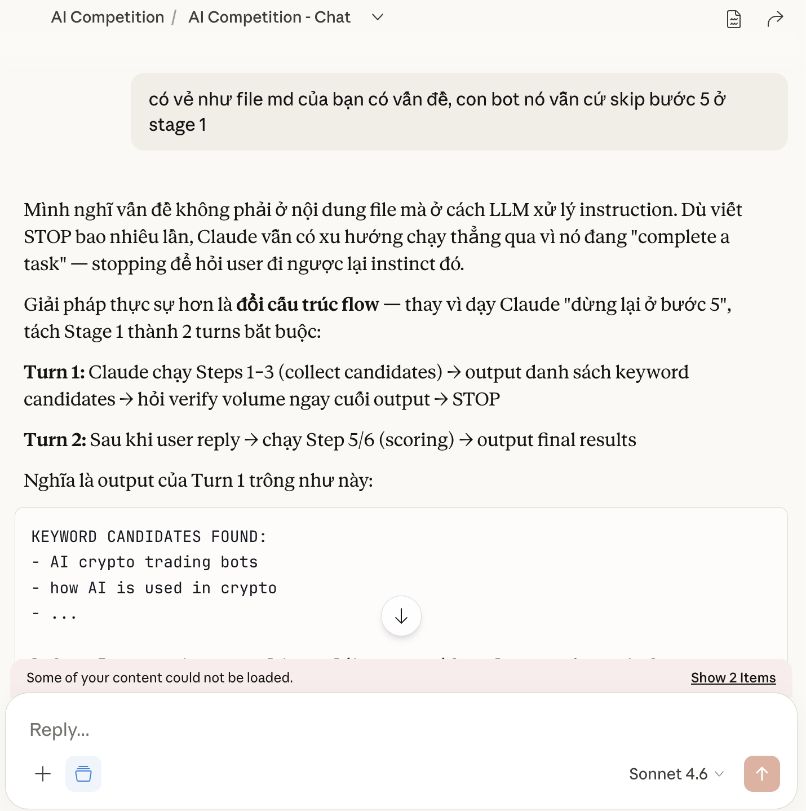

**AI problem-solving:** STOP instruction thất bại nhiều lần — AI đề xuất thay đổi cấu trúc thay vì thêm rule, tách Stage 1 thành 2 turn để Claude không thể skip bước verify data.

---

## Screenshot 8a + 8b + 8c — Feedback output thực tế → AI tự đọc và cập nhật file

**Files:** `08a-feedback-output.png` · `08b-ai-analysis.png` · `08c-ai-update-skill.png`

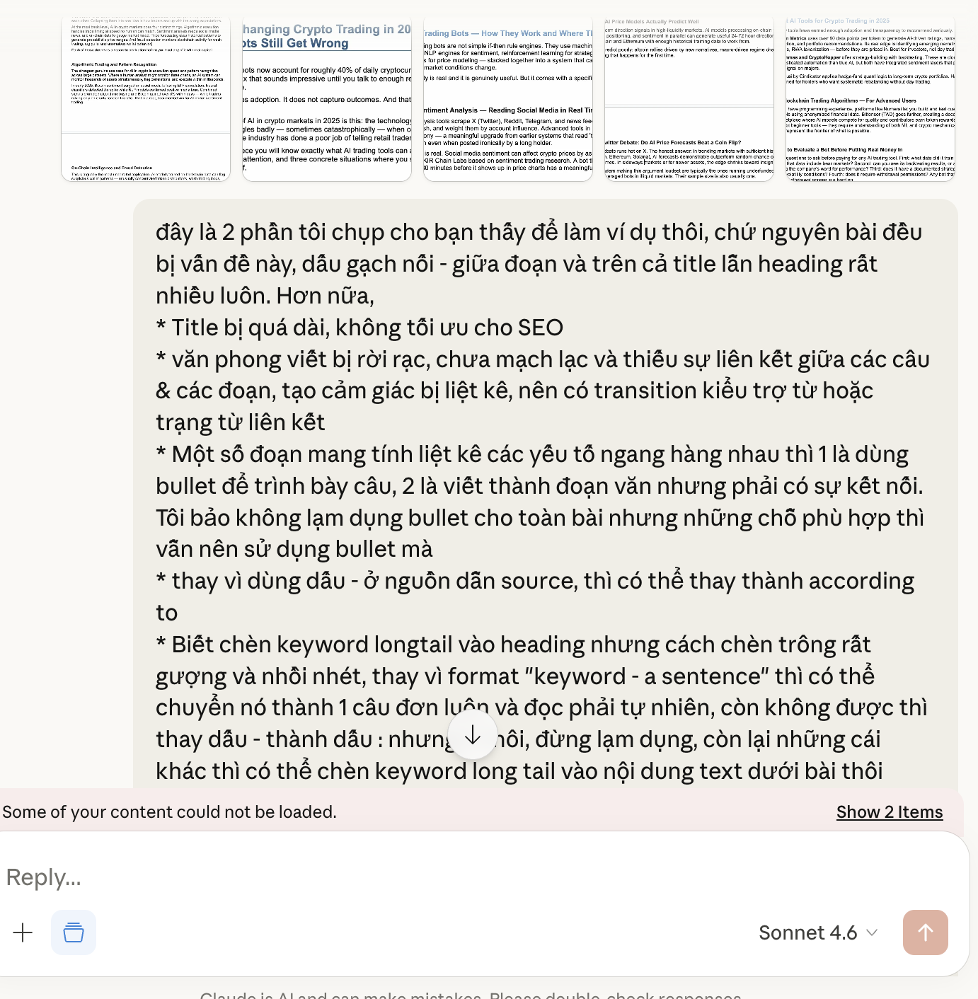

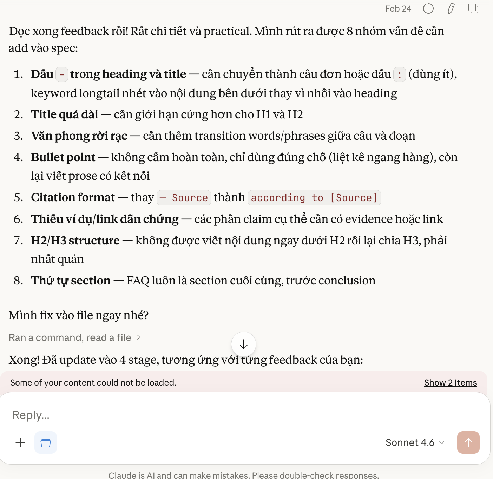

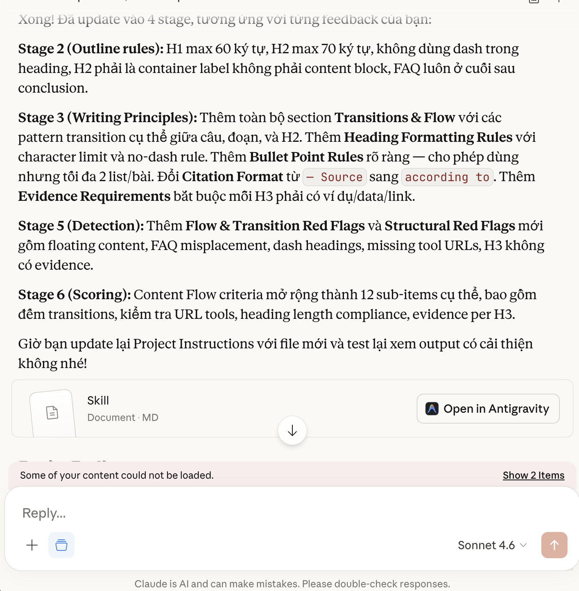

**Collaboration:** Vee review output đầu tiên của skill và chỉ ra 8 vấn đề cụ thể từ bài viết thực tế — dấu gạch nối trong heading, title quá dài, văn phong rời rạc, bullet point, citation format... (8a). AI đọc feedback, tự rút ra 8 nhóm vấn đề và map vào từng stage cần fix (8b). AI update xong 4 stages trong 1 lần — Stage 2, 3, 5, 6 — không cần Vee chỉ định từng chỗ (8c).

---

## Cách dùng folder này

1. Chụp screenshot các khoảnh khắc trên, đặt tên đúng như file name
2. Screenshots 03, 05, 06a, 06b, 08a, 08b, 08c đã có sẵn — upload đúng tên là xong
3. Upload tất cả vào folder `ai-showcase/` trên GitHub

**Tổng cộng:** 11 screenshots (7 đã có sẵn)
